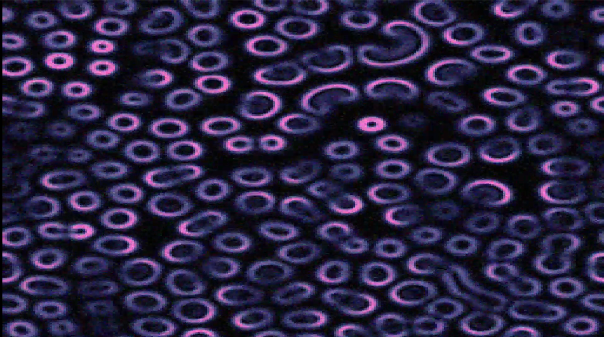
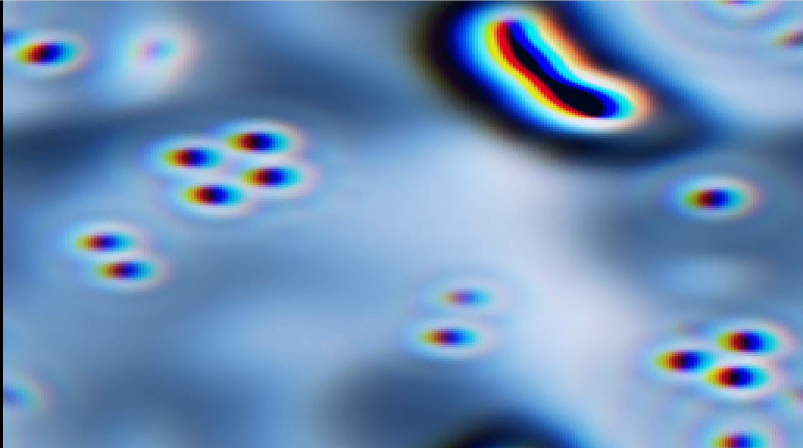
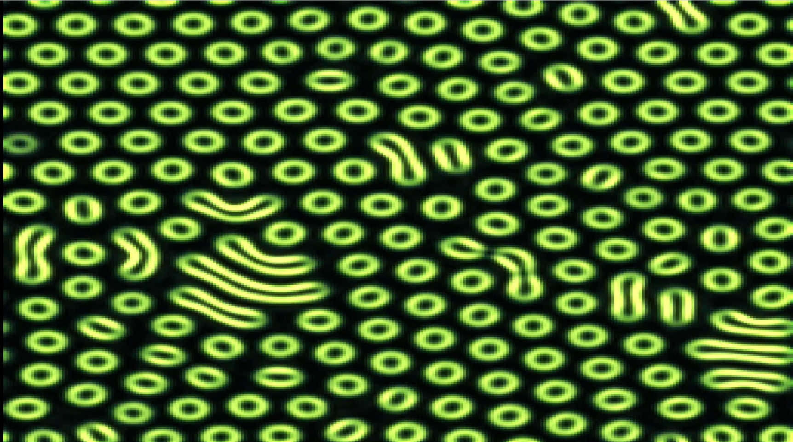
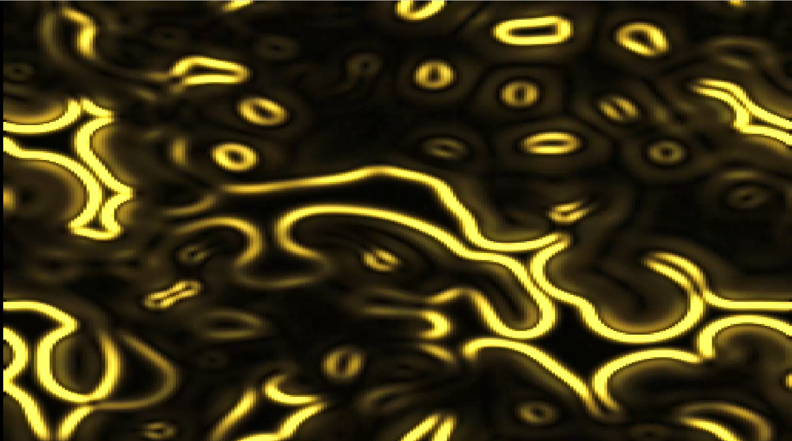
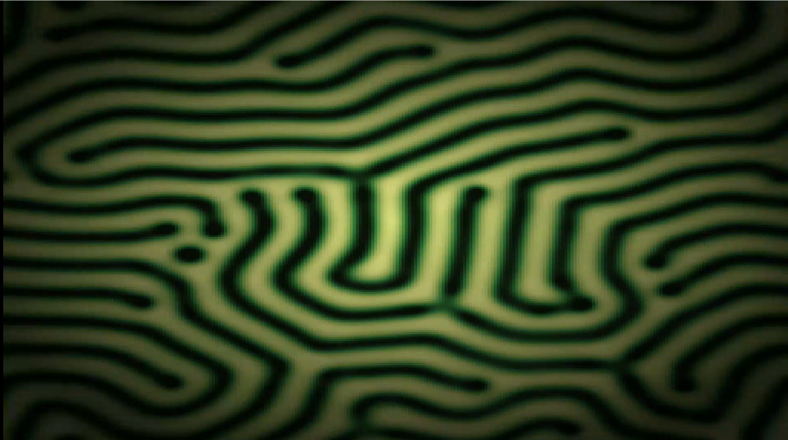
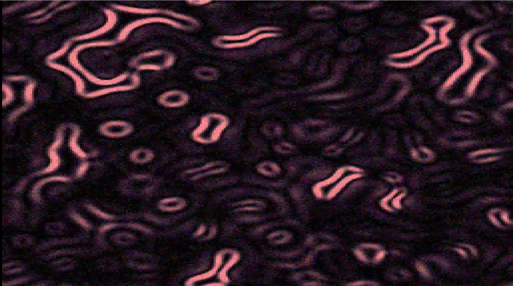

# Somnivex
*somnium (dream) + texere (to weave) — dream weave*

**Autonomous generative art. Runs forever. Never repeats.**

[](https://www.youtube.com/watch?v=buNGsdpu__8)

| | | |
|---|---|---|
|  |  |  |
|  |  |  |

Somnivex is an open-source generative art system with two layers: a Gray-Scott reaction-diffusion simulation running on GPU, and a trained Neural Cellular Automaton that learned GS physics and now runs freely on its own output — producing patterns that blend and morph between regimes in ways no fixed simulation can. Spirals dissolve into worms. Diamonds collapse into swirls. It finds its own path.

No prompts. No inputs. Just autonomous behavior.

---

## What it looks like

**Phase 1 (Gray-Scott):** 15 distinct behavioral regimes — spirals, maze, fingerprint, bacteria, uskate world, and more. 117 color palettes, 5 rendering modes, 6 post-processing effects. The world drifts between regimes every few minutes.

**Phase 2 (NCA Free Run):** A neural network trained on Gray-Scott physics runs entirely on its own output. It knows all 15 regimes simultaneously — f and k control channels steer it, but it blends and interprets them through its own learned weights. Diamonds that evolve into ovals. Swirls that emerge from the collapse of structure. Things GS alone never does.

**Rendering modes** — same chemistry, completely different image:
- `B` — raw chemical concentration (classic)
- `edges` — structure boundaries glow, spirals become rings
- `reaction` — only the active chemistry zone lights up
- `differential` — maximum contrast at the reaction front
- `A_inv` — the food layer, inverted

**Effects** — applied on top of any mode:
- bloom, vignette, chromatic aberration, film grain, scanlines

---

## Screen modes

**Single screen** — fullscreen on one monitor.

**Mirrored dual screen** — one wide window spanning two monitors, same image on both. Set `DUAL_SCREEN = True` in `config.py`.

---

## Running it

> **Tested on Linux (Ubuntu 24.04) only.** CUDA required for GPU mode — CPU-only works but slower.

```bash
# Clone and set up
git clone https://github.com/kosmickroma/somnivex
cd somnivex
pip install jax[cuda] flax optax pygame numpy

# Run Gray-Scott screensaver (Phase 1)
python main.py

# Run NCA free run (Phase 2 — requires trained checkpoint)
python nca/run_free.py
```

**GS Controls:**
| Key | Action |
|-----|--------|
| `U` | Like this era |
| `D` | Dislike |
| `S` | Skip to next regime |
| `Space` | Pause / unpause |
| `Q` | Quit |

**NCA Controls:**
| Key | Action |
|-----|--------|
| `F` | Cycle GS regime (poke the control channels) |
| `R` | Reset grid with new random seed |
| `P` | Cycle color palette |
| `Q` | Quit |

### Screensaver mode

```bash
python main.py --screensaver
```

On GNOME you can bind this to a keyboard shortcut via Settings → Keyboard → Custom Shortcuts.

---

## How it works

### Layer 1 — Gray-Scott reaction-diffusion

Two chemicals A (food) and B (predator) obey:

```
dA/dt = Da·∇²A − A·B² + f·(1−A)
dB/dt = Db·∇²B + A·B² − (f+k)·B
```

`f` (feed rate) and `k` (kill rate) determine everything. The simulation runs 15 named parameter regimes from Pearson's 1993 catalog, morphing between them instead of resetting hard. Grid is 256×256 on GPU via JAX. ~900 reaction steps per second.

### Layer 2 — Neural Cellular Automaton

A small neural network (17,000 parameters) runs the same update rule on every cell of the grid simultaneously. Each cell sees its 3×3 neighborhood through 4 fixed perception filters (identity, Sobel X, Sobel Y, Laplacian) — 64 inputs total. The network outputs a delta — how much to nudge each of the cell's 16 state channels.

16 channels per cell:
- `0` — chemical A
- `1` — chemical B
- `2–13` — hidden state (the NCA decides what to use these for)
- `14` — feed rate f (control input)
- `15` — kill rate k (control input)

**Training:** Pool-based multi-step rollout. A pool of 512 live GS states (random regimes, random ages) is maintained. Each training step: sample 32 states → run NCA 8 steps on its own output → compare to GS running 8 steps from the same start → backprop → write NCA outputs back to pool. 50,000 steps total (~4 hours on a GTX 1650).

The result: one model that internalized all 15 GS regimes simultaneously. Changing f and k mid-run changes its behavior without restarting anything — the NCA reads the control channels every step and responds. But it also has its own interpretation of those physics, expressed through its hidden channels. That's where the non-GS behavior comes from.

### Spatial f/k parameter fields

Instead of broadcasting a single f and k value to every cell, the system generates a smooth 2D noise field — each cell receives its own f and k drawn from a slowly drifting sine-wave landscape. Different regions of the grid live in different parameter regimes simultaneously. One corner might be in spiral territory while another is in near-starvation territory where only ghost traces survive.

The field drifts on four independent phase clocks, so what was worm territory slowly becomes coral territory becomes blob territory without any hard transition. The whole grid can never lock into one attractor because no two regions are ever in exactly the same parameter state. This is implemented entirely at runtime — no retraining required. The landscape is pure geometry layered on top of the trained physics.

---

## Hardware

Tested on:
- GPU: NVIDIA GTX 1650 (4GB VRAM) — CUDA 13.1
- CPU: Intel i7-2600
- OS: Ubuntu 24.04
- Python 3.12 + JAX + Flax + Optax + Pygame

Should run on any CUDA GPU. CPU-only works (slower).

---

## Color System

117 hand-crafted palettes across 15 categories: space/celestial, ocean/water, geological/mineral, biological/cellular, industrial, atmospheric, fire variations, digital/terminal, fantasy, neon/electric, moody/desaturated, high contrast, warm/fire, cool/ice, and nature/organic.

---

## Roadmap

### ✅ Phase 1 — Gray-Scott Screensaver
GPU simulation, 15 regimes, 117 palettes, 5 render modes, 6 effects, dual screen, screensaver mode, preference rating system.

### ✅ Phase 2 — NCA Physics Training
Neural Cellular Automaton trained on GS physics via pool-based multi-step rollout. Runs freely on its own output indefinitely. One model covers all 15 regimes via control channels. Produces patterns that blend and morph between GS behaviors in novel ways.

### ✅ Phase 3 — Autonomous Steering
Saturation detection, autonomous f/k drift, perturbation sequences, extreme bursts, timed reseeds, and autonomous palette crossfading. The system runs indefinitely without intervention.

**Spatial f/k parameter fields** (Phase 3 extension): Each cell gets its own f/k from a drifting 2D noise field. Different regions behave in different regimes simultaneously — the whole grid can never collapse to one state. No retraining required.

### Phase 4 — Expanded Physics
Train the NCA on additional reaction-diffusion systems alongside GS — Turing patterns, Lenia, or others. With multiple physics in the training data, the NCA blends them together in free run, producing morphologies that no single system generates alone.

### Phase 5 — Color Intelligence
Color as part of the NCA's state, not a post-processing lookup. The network learns associations between chemical patterns and color expressions during training. In free run it chooses and evolves its own palette based on what it's doing.

### Phase 6 — Livestream Output
24/7 autonomous generative art stream. The system runs indefinitely, steers itself away from dead states, and pipes output to OBS. No human needed.

---

## Philosophy

Somnivex is not a tool you operate. It runs on its own, decides everything, and shows you what it made. The only input you can give is signal — like or dislike — and over time the system steers toward what you respond to.

The longer-term goal is a system that is genuinely autonomous: one that explores its own parameter space, discovers novel visual states, and sustains itself indefinitely without intervention. The NCA is the first step toward that — a model that learned physics from data and now runs those physics from memory, finding paths through the space that the original equations never would.

---

## Contact

Questions, bugs, ideas — open an issue or reach out:
📧 kosmickroma@gmail.com

---

## License

MIT. Use it, fork it, build on it.
